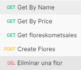

# PT-KS - Readme

La aplicación está en Java SpringBoot versión 2.7.8

Java version: 1.8

Maven: 4.0

## Postman

En el siguiente link podrán encontrar una colección de Postman con cada uno de los endpoint expuestos. [Postman click acá](https://app.getpostman.com/join-team?invite_code=b5f92e627ec567c89752bfa8dfdacdea&target_code=b34caf467719d0e42e4cb2998029491b)

Se encontrarán los siguientes endpoint:



### Get By Name

A través del parámetro pName en el Query traerá aquellos que contengan el nombre que se envía por parámetro:

[http://localhost:8080/api/flores?pName=amapola](http://localhost:8080/api/flores?pName=amapola)

### Gety By Price

A través del parámetro pPrice en el query traerá aquellos que estén sobre ese precio incluyendo aquellos que sean mayores a 20 cuando pPrice=20.

[http://localhost:8080/api/flores?pPrice=20.0](http://localhost:8080/api/flores?pPrice=20.0)

### Get floreskometsales

Trae las flores ordenadas alfabéticamente descendente y solo retorna los campos name y price

[http://localhost:8080/api/floreskometsales](http://localhost:8080/api/floreskometsales)

### Create Flores

Se le envía un JSON con las flores y este las procesará para guardarlas en la variable estática

[http://localhost:8080/api/flores](http://localhost:8080/api/flores)

Ejemplo del JSON

```json
[
    {
        "id": 1,
        "name": "amapola",
        "price": 13.0
    },
    {
        "id": 2,
        "name": "bmapola",
        "price": 12.0
    },
    {
        "id": 3,
        "name": "gmapola",
        "price": 13.0
    },
    {
        "id": 4,
        "name": "Lobelia",
        "price": 13.0
    }
]
```

### Eliminar una flor

Elimina la flor del ID pasado en la URL

[http://localhost:8080/api/flores/1](http://localhost:8080/api/flores/1)

# Pruebas

En la parte de pruebas unitarias se utilizó el archivo: FloresControllerTest

Ubicado en src\test\java\com\prueba\apirest\FloresControllerTest.java

## findAll

Utiliza el createFlores1() para llenar la variable estática y como resultado deben haber 6 flores en el arreglo.

Utiliza el createFlores2() para llenar la variable estática y como resultado deben haber 5 flores en el arreglo.

## findAllkometsales

Hace un get al enpoint /api/floreskometsales

Valida que los elementos del arreglo que trae y verifica que el actual sea lexicográficamente mayor al siguiente a través de un compareTo.

Adicionalmente valida que traiga en la variable name ‘kometsales’

## findAllOverPrice

Hace un get al enpoint /api/flores?pPrice=20.0 y hace 2 pruebas

1. Un inicial con pPrice=20.0 que debe traer 3 resultados
2. Una segunda prueba con pPrice=26.0 que debe traer 2 flores de resultados

## deleteFlor

Hace el delete de una flor y comprueba que el resultado de hacer get después del delete es 4. 

## findAllByName

Trae los nombres que tengan amapola que sólo debe ser 1

Trae los nombres que tengan petunia en este caso serían 2. 

## createFlores2

Crea un conjunto de flores de pruebas

## createFlores1

Crea un conjunto de flores de pruebas
